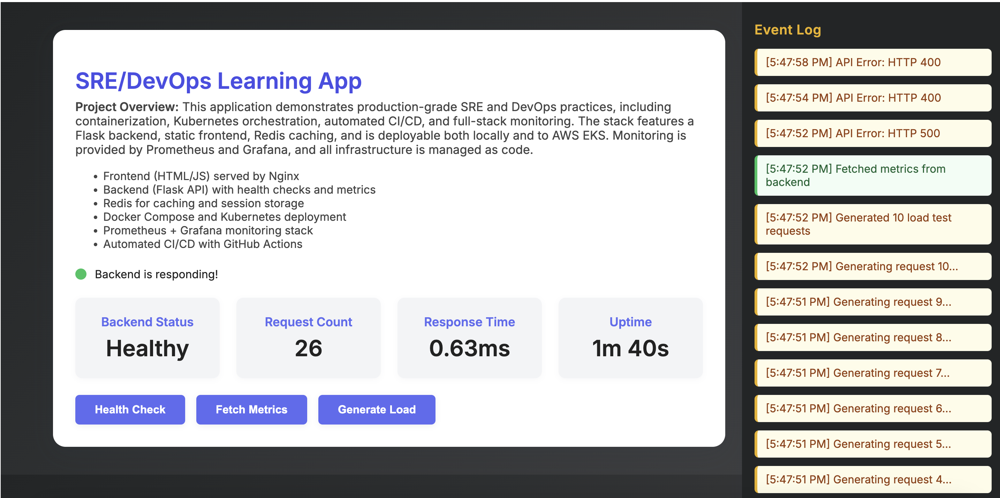
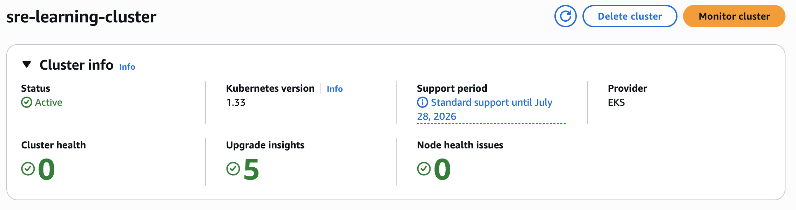
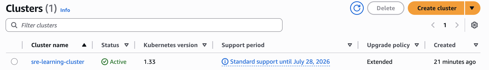
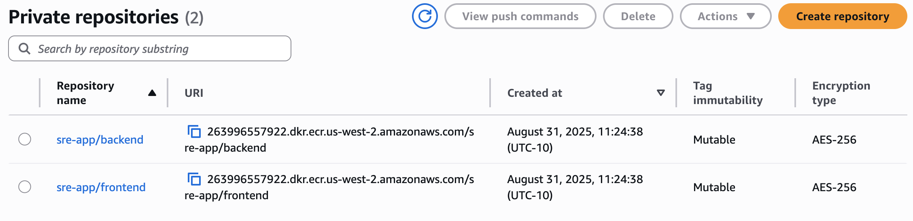
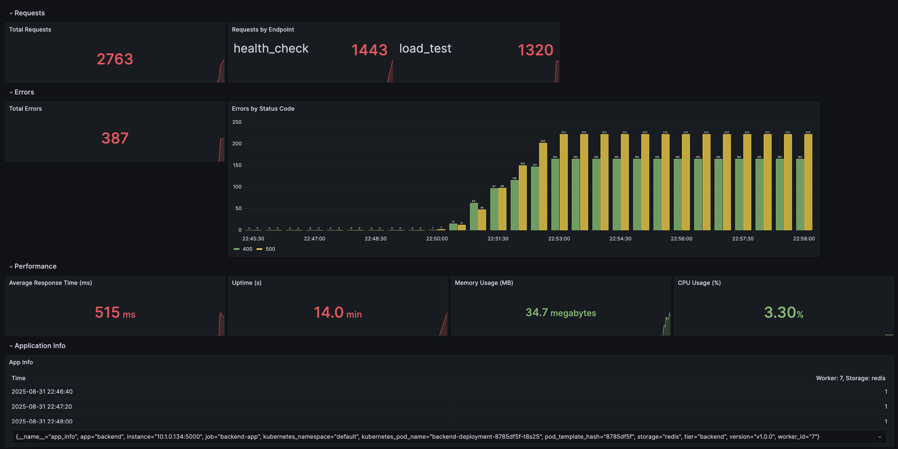
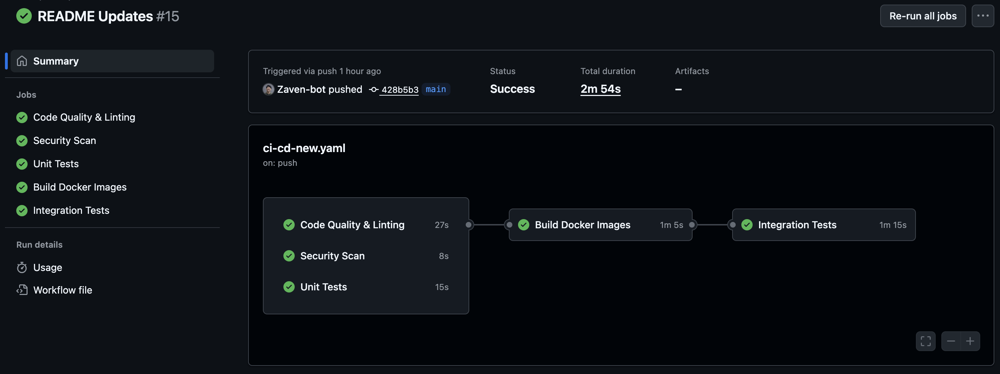

# SRE Learning App

A production-ready infrastructure project demonstrating comprehensive SRE and DevOps practices. During my time at Alegeus, I realized a big gap in my knowledge was understanding how my code went from my computer to helping real people. In order to bridge this gap in my understanding and to prepare myself to help at any part of the stack, this project implements a complete application stack with Flask backend, static frontend, Redis caching, and full observability through Prometheus and Grafana monitoring.




## Architecture Overview

```
┌─────────────────────────────────────────────────────────────────────────────┐
│                              Internet                                       │
└─────────────────────────┬───────────────────────────────────────────────────┘
                          │
┌─────────────────────────▼───────────────────────────────────────────────────┐
│                    AWS Application Load Balancer                           │
│                         (ALB/Ingress)                                      │
└─────────────────────────┬───────────────────────────────────────────────────┘
                          │
┌─────────────────────────▼───────────────────────────────────────────────────┐
│                     Kubernetes Cluster (EKS)                               │
│  ┌─────────────────┐  ┌─────────────────┐  ┌─────────────────────────────┐ │
│  │   Frontend      │  │    Backend      │  │      Monitoring             │ │
│  │   (Nginx)       │  │   (Flask API)   │  │   ┌─────────────────────┐   │ │
│  │  ┌───────────┐  │  │  ┌───────────┐  │  │   │    Prometheus      │   │ │
│  │  │ HTML/CSS/ │  │  │  │  Python   │  │  │   │   (Metrics)        │   │ │
│  │  │    JS     │  │  │  │   Flask   │  │  │   └─────────────────────┘   │ │
│  │  └───────────┘  │  │  │  Health   │  │  │   ┌─────────────────────┐   │ │
│  │   Port: 80      │  │  │  Metrics  │  │  │   │     Grafana         │   │ │
│  │   Replicas: 2   │  │  └───────────┘  │  │   │   (Dashboards)      │   │ │
│  └─────────────────┘  │   Port: 5000    │  │   └─────────────────────┘   │ │
│                       │   Replicas: 3   │  │                             │ │
│                       └─────────────────┘  └─────────────────────────────┘ │
└─────────────────────────────────────────────────────────────────────────────┘
```

### Component Details

| Component | Purpose | Replicas | Ports | Key Features |
|-----------|---------|----------|-------|--------------|
| **Frontend** | Nginx serving static files with API proxy | 2 | 80 | Rate limiting, health checks |
| **Backend** | Gunicorn WSGI server with Flask app | 3 | 5000 | 2+ workers per pod, metrics endpoint |
| **Redis** | Shared metrics storage and caching | 1 | 6379 | Persistent storage, backup |
| **Prometheus** | Metrics collection and alerting | 1 | 9090 | Service discovery, 30-day retention |
| **Grafana** | Visualization dashboards | 1 | 3000 | Auto-configured data sources |

## Quick Start

### Option 1: Docker Compose (Fastest)
```bash
# Start the complete stack locally
docker compose up -d

# Access services:
# Backend: http://localhost:6000
# Frontend: http://localhost:80
# Prometheus: http://localhost:9090
# Grafana: http://localhost:3000 (admin/admin)
```

### Option 2: Local Kubernetes
```bash
# Deploy to local cluster (minikube, kind, docker-desktop)
./scripts/sre-app.sh up

# Access services (starts port-forwarding)
./scripts/sre-app.sh access

# Check status
./scripts/sre-app.sh status

# Clean up
./scripts/sre-app.sh down

# To access the other services via port-forwarding, use the following commands (run each in a separate terminal):

# Frontend:
kubectl port-forward svc/frontend-service 8080:80

# Backend:
kubectl port-forward svc/backend-service 8000:5000

# Prometheus:
kubectl port-forward svc/prometheus-service 9090:9090

# Grafana:
kubectl port-forward svc/grafana-service 3000:3000
```


### Option 3: AWS EKS (Cloud Deployment)
```bash
# Provision AWS infrastructure and deploy
./scripts/deploy-aws.sh

# Note: AWS deployment is a pain
# Be prepared for IAM permissions, VPC configurations, and billing surprises
```

Successful AWS EKS cluster deployment




## Project Structure

```
sre-app/
├── app/
│   ├── backend/              # Flask API with health checks and metrics
│   └── frontend/             # Static HTML/JS interface
├── docker/
│   ├── Dockerfile.backend    # Multi-stage Python build
│   ├── Dockerfile.frontend   # Nginx-based frontend
│   └── docker-compose.yml    # Complete local stack
├── k8s/                      # Kubernetes manifests (production-ready)
│   ├── deployment-*.yaml     # Application deployments
│   ├── service-*.yaml        # Service definitions
│   ├── prometheus.yaml       # Monitoring configuration
│   ├── grafana.yaml          # Dashboard setup
│   ├── hpa.yaml              # Horizontal Pod Autoscaler
│   └── network-policies.yaml # Security policies
├── scripts/
│   ├── sre-app.sh            # Main deployment controller
│   ├── build.sh              # Docker image builder
│   ├── deploy.sh             # Kubernetes orchestrator
│   └── port-forward.sh       # Service access helper
├── .github/workflows/
│   └── ci-cd-new.yaml        # Complete CI/CD pipeline
└── infra/aws/                # Terraform for AWS EKS
    └── main.tf
```

## Production Features

### Horizontal Pod Autoscaler (HPA)
Backend automatically scales based on:
- **CPU Utilization**: > 70%
- **Memory Utilization**: > 80%
- **Scaling Range**: 2-10 pods
- **Scale-up Policy**: Wait 1min, add up to 100% more pods (max 2 at once)
- **Scale-down Policy**: Wait 5min, remove up to 50% of pods

### Resource Management

| Component | Memory Request | Memory Limit | CPU Request | CPU Limit |
|-----------|----------------|--------------|-------------|-----------|
| Backend   | 256Mi         | 512Mi        | 200m        | 500m      |
| Frontend  | 64Mi          | 128Mi        | 50m         | 100m      |
| Redis     | 128Mi         | 512Mi        | 100m        | 300m      |
| Prometheus| 512Mi         | 1Gi          | 200m        | 500m      |
| Grafana   | 256Mi         | 512Mi        | 100m        | 300m      |

### Persistent Storage

- **Redis**: 5Gi for data persistence
- **Prometheus**: 10Gi for metrics storage (30-day retention)
- **Grafana**: 5Gi for dashboards and configuration

### Security Implementation

#### Network Policies
- **Backend**: Accessible from frontend and prometheus only
- **Redis**: Backend access only
- **Prometheus**: Can scrape backend, accessible from grafana
- **Grafana**: External access only via port-forward

#### Container Security
- Non-root user execution in all containers
- Multi-stage Docker builds for minimal attack surface
- Vulnerability scanning in CI pipeline
- Resource limits and health checks configured
- Read-only root filesystems where possible

### Health Checks & Monitoring

#### Health Endpoints
```bash
# Backend health check
curl http://backend-service:5000/health

# Backend metrics (Prometheus format)
curl http://backend-service:5000/metrics
```

#### Prometheus Monitoring Targets
- **Backend metrics**: `backend-service:5000/metrics`
- **Kubernetes API**: Service discovery enabled
- **Self-monitoring**: Prometheus internal metrics
- **Custom business metrics**: Application-specific metrics

#### Grafana Dashboards
- **Access**: http://localhost:3000 (admin/admin)
- **Data Source**: Prometheus automatically configured
- **Dashboards**: System overview, application performance, resource utilization



## Configuration Details

### Environment Variables
```yaml
# Backend deployment configuration
- name: REDIS_HOST
  value: redis-service
- name: REDIS_PORT
  value: "6379"
- name: FLASK_ENV
  value: production
- name: GUNICORN_WORKERS
  value: "2"
```

### Service Discovery
```yaml
# Prometheus service discovery configuration
- job_name: 'kubernetes-pods'
  kubernetes_sd_configs:
  - role: pod
```

## CI/CD Pipeline



GitHub Actions automatically handles:

### Code Quality & Testing
- **Linting**: flake8, black formatting
- **Unit Tests**: pytest with coverage
- **Security Scanning**: Trivy container vulnerability analysis
- **Integration Testing**: Full stack verification

### Build & Deploy
- **Docker Images**: Multi-stage builds pushed to GitHub Container Registry
- **Automated Testing**: Complete stack integration tests
- **Deployment**: Triggered on pushes to main/develop branches

## Deployment Environments

### Local Development
- **Docker Compose**: Rapid iteration and testing
- **Services**: All components running locally
- **Access**: Direct port access to all services

### Local Kubernetes
- **Clusters**: minikube, kind, docker-desktop
- **Access**: Port-forwarding for service access
- **Storage**: Default StorageClass (no explicit storageClassName needed)

### AWS EKS Production
- **Infrastructure**: Terraform-managed VPC, EKS cluster, security groups
- **Networking**: Application Load Balancer, private subnets
- **Storage**: EBS volumes with gp3 StorageClass
- **Scaling**: Cluster autoscaler + HPA
- **Reality Check**: "AWS deployment is a pain in the ass" - expect IAM hell

## Troubleshooting

### Useful Commands

```bash
# Check all resources
kubectl get all

# View events sorted by time
kubectl get events --sort-by=.metadata.creationTimestamp

# Check HPA status
kubectl get hpa backend-hpa

# View application logs
kubectl logs -f deployment/backend-deployment
kubectl logs -f deployment/prometheus-deployment

# Debug networking
kubectl exec -it deployment/backend-deployment -- nslookup redis-service
kubectl exec -it deployment/backend-deployment -- curl redis-service:6379

# Check metrics endpoints
kubectl exec -it deployment/backend-deployment -- curl localhost:5000/metrics
kubectl exec -it deployment/backend-deployment -- curl localhost:5000/health
```

### Common Issues

**Cannot connect to Kubernetes cluster**:
```bash
kubectl config get-contexts
kubectl config use-context <your-context>
kubectl get nodes
```

**PVC storage issues**:
- Local clusters: Omit `storageClassName` (uses default)
- AWS EKS: Use `storageClassName: gp3`

**AWS EKS deployment problems**:
- Check IAM permissions for EKS cluster creation
- Verify AWS CLI credentials and region configuration
- Review VPC and subnet configurations
- Monitor AWS billing (it adds up fast)

## Testing

### Local Testing
```bash
cd app/backend
python -m pytest test_app.py -v
```

### Integration Testing
```bash
# Start stack and run integration tests
docker compose up -d
./scripts/test-integration.sh
```

### Load Testing
```bash
# Test HPA scaling behavior
kubectl run -i --tty load-generator --rm --image=busybox --restart=Never -- /bin/sh
# Then run: while true; do wget -q -O- http://backend-service:5000/api/data; done
```

## Technology Stack

### Application
- **Frontend**: HTML5, CSS3, JavaScript, Nginx
- **Backend**: Python 3.11, Flask, Gunicorn
- **Cache/Storage**: Redis
- **APIs**: RESTful with comprehensive health checks

### Infrastructure
- **Containers**: Docker with multi-stage builds
- **Orchestration**: Kubernetes with proper resource management
- **Cloud**: AWS EKS with VPC, ALB, Security Groups
- **IaC**: Terraform for infrastructure provisioning

### Monitoring & Observability
- **Metrics**: Prometheus with custom exporters
- **Visualization**: Grafana dashboards
- **Logging**: Structured JSON logging
- **Health Checks**: Liveness and readiness probes

### CI/CD
- **Version Control**: Git with feature branch workflow
- **CI/CD**: GitHub Actions with comprehensive testing
- **Registry**: GitHub Container Registry
- **Security**: Vulnerability scanning, code quality checks

## Future Enhancements

**Completed Features**:
- ✅ Complete Kubernetes deployment with HPA
- ✅ Comprehensive monitoring stack
- ✅ Security policies and container hardening
- ✅ Automated CI/CD pipeline
- ✅ AWS EKS support (painful but functional)

**Potential Improvements**:
- [ ] Service mesh implementation (Istio)
- [ ] GitOps with ArgoCD
- [ ] Chaos engineering experiments
- [ ] SLI/SLO implementation with error budgets
- [ ] Advanced alerting rules
- [ ] Performance testing automation
- [ ] Multi-region deployment

## Getting Started

### Prerequisites
- Docker and Docker Compose
- Kubernetes cluster (local or AWS EKS)
- kubectl configured for your target cluster
- AWS CLI and credentials (for EKS deployment only)

### Quick Installation

1. **Clone and start locally**:
```bash
git clone https://github.com/Zaven-bot/sre-app.git
cd sre-app
docker compose up -d
```

2. **Verify services**:
```bash
curl http://localhost:6000/health
curl http://localhost:6000/api/data
```

3. **Deploy to Kubernetes**:
```bash
./scripts/sre-app.sh up
./scripts/sre-app.sh access
```

**Important**: Ensure your `kubectl` context is set to your desired cluster before deployment. Use `kubectl config get-contexts` to verify.

This project demonstrates production-ready SRE practices while remaining accessible for learning and experimentation. The architecture showcases real-world complexity with comprehensive documentation for educational purposes.
